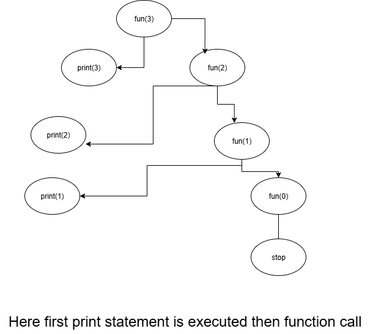

# 🔄 Introduction to Recursion

---

## 📌 What is Recursion?
Recursion is a **programming technique** where a function calls itself, either **directly** or **indirectly**, to solve a problem.  
It simplifies complex problems by breaking them down into smaller subproblems until a simple **base case** is reached.

---

## 💻 Example Code Snippet (C)

```c
#include <stdio.h>

void fun(int n) {
    if (n > 0) {            // base case check
        printf("%d\n", n);  // print current value
        fun(n - 1);         // recursive call
    }
}

int main() {
    fun(3);                 // function call
    return 0;
}
```
#### output for the above code is `3 2 1` ####
## 🌳 What is a Tracing Tree?

A Tracing Tree (also called Recursion Tree) is a diagrammatic representation of recursive calls made by a function.

- It helps us trace the execution flow step by step.

- Each node in the tree represents a function call.

- The branches show how one function call leads to further recursive calls.



# 🔁 Loops vs 🔄 Recursion

## 1. Definition
- **Loop**: A control structure (`for`, `while`, `do-while`) that repeats a block of code until a condition is false.  
- **Recursion**: A function calls itself (directly or indirectly) until a base condition is 
met. 

## 3. Key Differences

| Aspect              | Loop                                  | Recursion                                                       |
|---------------------|---------------------------------------|-----------------------------------------------------------------|
| **Control Mechanism** | Uses iteration (`for`, `while`)       | Function calls itself                                            |
| **Termination**      | Condition in loop header/body         | Base condition                                                   |
| **Memory Usage**     | Efficient (constant memory)           | Each call adds a stack frame → more memory usage                 |
| **Performance**      | Usually faster                       | Slower due to function call overhead                             |
| **Readability**      | Better for simple repetition          | Better for problems with natural recursive structure (trees, divide & conquer) |
| **Risk**             | Infinite loop if condition never false | Stack overflow if base case missing                              |


---

