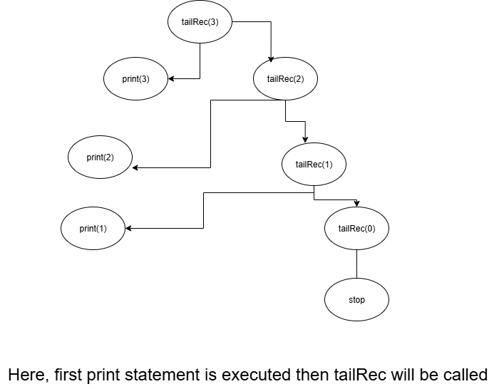
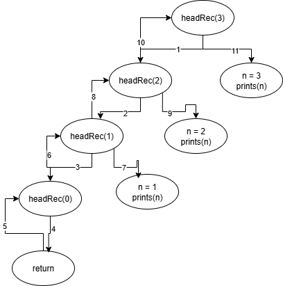
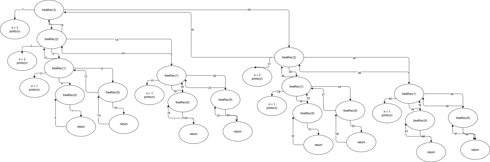
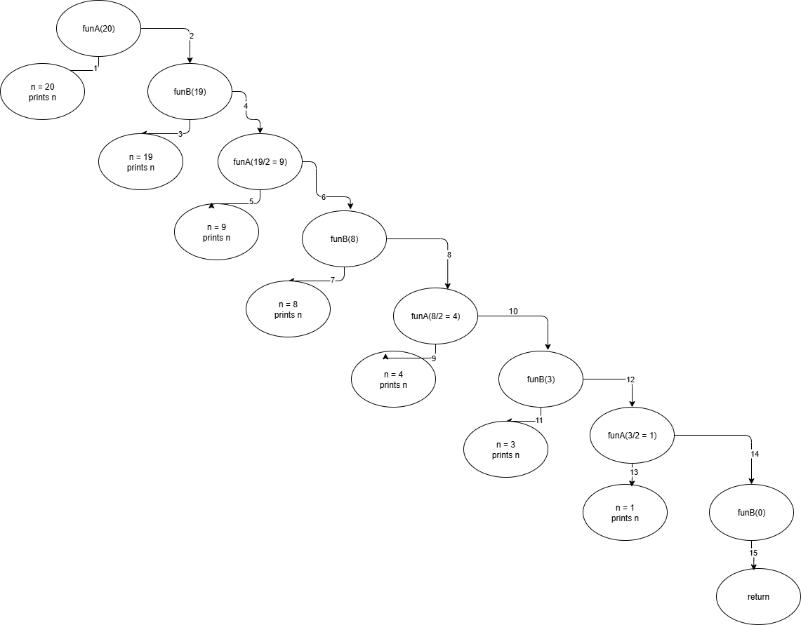

# 📚 Types of Recursion in Detail

---


## 1. Tail Recursion

In tail recursion, the recursive call is the last operation performed by the function.

All actions or statements are executed before the recursive call, and nothing is left to do after the call returns.

In case of tail recursion, loops are preferred as we can easily write code in loops by looking at tail recursion code.

### Example:
```c
#include <stdio.h>
void tailRec(int n) {
    if (n == 0) return;
    printf("%d ", n);
    tailRec(n - 1); // Recursive call is the last statement
}

int main() {
    tailRec(3);
    return 0;
}
```

**Output:** `3 2 1`

## Tracing Tree:


---

## Changing above tail recursion into the loop:

```c
void fun(int n){
    while(n > 0){
        printf("%d ", n);
        n--;
    }
}
```

**Output:** `3 2 1`

---

### 🔍 Time Complexity

The while loop runs as long as `n > 0`. In each iteration:

- It prints the value of `n` (which is an O(1) operation).
- Then decrements `n` by 1.

So, the loop executes `n` times, doing constant work each time.

✅ **Time Complexity: O(n)**

---

### 🧠 Space Complexity

This version uses iteration, not recursion. So:

- No recursive call stack is created.
- No additional memory is allocated except for the variable `n`.

✅ **Space Complexity: O(1)**

---

### 📌 Summary

| Complexity Type | Value | Reason               |
|-----------------|--------|----------------------|
| Time            | O(n)   | Loop runs `n` times  |
| Space           | O(1)   | No recursion, constant space |

---

## Conclusion

As you can see, the loop version behaves similarly to the tail recursion version. However, in terms of space complexity, the loop is preferred because it avoids the overhead of recursive stack frames.

---

## 2. Head Recursion

In head recursion, the recursive call happens before any other operations in the function.

**Example:**
```c
#include <stdio.h>
void headRec(int n) {
    if (n == 0) return;
    headRec(n - 1); // Recursive call happens first
    printf("%d ", n);
}
```


## 🔁 2. Head Recursion

### 📌 Definition:
In **head recursion**, the recursive call is made **before** any other operations in the function. This means the function keeps calling itself until it reaches the base case, and only then does it start executing the remaining statements **after** the recursive calls return.

---

### ✅ Example in C:
```c
#include <stdio.h>

void headRec(int n) {
    if (n == 0) return;
    headRec(n - 1); // Recursive call happens first
    printf("%d ", n); // Executed after recursive call returns
}

int main() {
    headRec(3);
    return 0;
}
```

### 🧠 Execution Flow:
Let’s break down how `headRec(3)` works:

1. `headRec(3)` calls `headRec(2)`
2. `headRec(2)` calls `headRec(1)`
3. `headRec(1)` calls `headRec(0)`
4. `headRec(0)` hits the base case and returns
5. Now the calls start returning:
   - `headRec(1)` prints `1`
   - `headRec(2)` prints `2`
   - `headRec(3)` prints `3`

### 🖨️ Output:
```
1 2 3
```
## Tracing Tree:

---

## 🔄 Head Recursion vs Loop

### 🧾 Loop Version:
```c
void fun(int n){
    int i = 1;
    while(i <= n){
        printf("%d ", i);
        i++;
    }
}
```

### 🧠 Execution Flow:
- The loop runs from `i = 1` to `n`, printing each value directly.

### 🖨️ Output:
```
1 2 3
```

---

## 🔍 Comparison

| Feature              | Head Recursion                          | Loop                                 |
|----------------------|------------------------------------------|--------------------------------------|
| **Control Flow**     | Function calls itself before doing work | Iterative, uses loop control         |
| **Memory Usage**     | Uses call stack (can be expensive)      | Efficient, uses constant memory      |
| **Execution Order**  | Bottom-up (work done after recursion)   | Top-down (work done immediately)     |
| **Readability**      | Good for problems with recursive nature | Easier for simple repetitive tasks   |
| **Performance**      | Slower due to overhead of recursion     | Faster and more efficient            |

---


---

## 🌳 Tree Recursion

### ✅ Code:
```c
void treeRec(int n) {
    if (n == 0) return;
    printf("%d ", n);
    treeRec(n - 1); // First recursive call
    treeRec(n - 1); // Second recursive call
}
```
### 🖨️ Output: when n = 3
```
3 2 1 1 2 1 1
```
## Tracing Tree:


---

## 🔢 Total Number of Calls

Let’s denote the number of calls as **T(n)**.

Each call to `treeRec(n)` makes **2 recursive calls** to `treeRec(n - 1)`, until `n == 0`.

So the recurrence relation is:

$$
T(n) = 2 \cdot T(n - 1) + 1
$$

Ignoring the `printf` operation and focusing on the number of calls:

- **T(0) = 0** (base case)
- **T(1) = 2 \* T(0) + 1 = 1**
- **T(2) = 2 \* T(1) + 1 = 3**
- **T(3) = 2 \* T(2) + 1 = 7**
- **T(4) = 2 \* T(3) + 1 = 15**

This forms a pattern:

$$
T(n) = 2^n - 1
$$

### ✅ So, total number of calls for `treeRec(n)` is:
**2ⁿ − 1**

---

## ⏱️ Time Complexity

Each call does a constant amount of work (`printf`) and makes 2 recursive calls.

So the time complexity is:

### **O(2ⁿ)**

---

## 🧠 Space Complexity

Space complexity depends on the **maximum depth of the recursion stack**.

Since each call makes two recursive calls, but they are made **sequentially**, not simultaneously, the maximum depth is **n**.

So:

### **O(n)** — due to the call stack depth

---

## 📊 Summary

| Metric               | Value                     |
|----------------------|---------------------------|
| **Total Calls**      | $$2^n - 1$$               |
| **Time Complexity**  | **O(2ⁿ)**                 |
| **Space Complexity** | **O(n)** (stack depth)    |

---

---


## 🔁 Indirect Recursion

### ✅ Code Summary:
```c
void funA(int n) {
    if (n == 0) return;
    printf("%d ", n);
    funB(n - 1);
}

void funB(int n) {
    if (n == 0) return;
    printf("%d ", n);
    funA(n / 2);
}
```

## Ouput funA(20) is ``` 20 19 9 8 4 3 1 ``` ##

## Tracing Tree:



### 🔍 Execution Flow for `funA(20)`:
Let’s trace the calls step-by-step:

1. `funA(20)` → prints 20 → calls `funB(19)`
2. `funB(19)` → prints 19 → calls `funA(9)`
3. `funA(9)` → prints 9 → calls `funB(8)`
4. `funB(8)` → prints 8 → calls `funA(4)`
5. `funA(4)` → prints 4 → calls `funB(3)`
6. `funB(3)` → prints 3 → calls `funA(1)`
7. `funA(1)` → prints 1 → calls `funB(0)`
8. `funB(0)` → returns (base case)

### 🧮 Total Number of Calls:
Each function alternates and reduces `n` either by `n - 1` or `n / 2`. The recursion ends when `n == 0`.

From the trace above, we see:
- Calls: `funA(20)`, `funB(19)`, `funA(9)`, `funB(8)`, `funA(4)`, `funB(3)`, `funA(1)`, `funB(0)`
- **Total calls = 8**

---

## ⏱️ Time Complexity

Let’s denote the number of calls as a function of `n`.

- `funA(n)` calls `funB(n - 1)`
- `funB(n)` calls `funA(n / 2)`

This creates a **non-linear recursive chain**, but the depth is limited due to the rapid reduction in `n`.

Let’s approximate the number of calls as:

### **O(log n)** — because `n` is halved in some steps (`n / 2`), which dominates the recursion depth.

---

## 🧠 Space Complexity

Each recursive call adds a frame to the call stack. Since the calls alternate and go down to `n == 0`, the **maximum depth** of the call stack is equal to the number of calls.

So:

### **O(log n)** — due to the recursive depth from alternating calls and halving `n`.

---

## 📊 Summary

| Metric               | Value                      |
|----------------------|----------------------------|
| **Total Calls**      | 8 (for `funA(20)`)         |
| **Time Complexity**  | **O(log n)**               |
| **Space Complexity** | **O(log n)** (stack depth) |


---

## 5. Nested Recursion

The argument of a recursive function itself involves a recursive call.

**Example:**
```c
#include <stdio.h>
int nestedRec(int n) {
    if (n > 100) return n - 10;
    return nestedRec(nestedRec(n + 11));
}
```

---

[⬅️ Back: Introduction to Recursion](./Introduction.md)